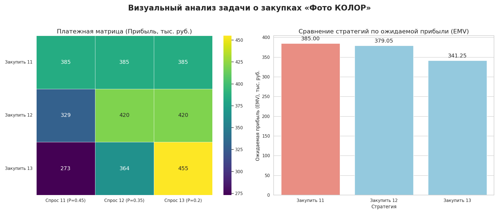

# Анализ и решение задачи о закупках для «Фото КОЛОР»

## 📌 1. Описание задачи

Компания «Фото КОЛОР» стоит перед классической проблемой управления запасами в условиях неопределенного спроса. Необходимо выбрать оптимальный объем еженедельной закупки фиксажа ВС-6.

**Экономические параметры:**

- **Прибыль** с проданного ящика: **35 тыс. рублей**.
- **Убыток** с непроданного (утилизированного) ящика: **56 тыс. рублей**.

**Рыночные условия (вероятности спроса):**

- Спрос **11 ящиков**: вероятность **0,45**
- Спрос **12 ящиков**: вероятность **0,35**
- Спрос **13 ящиков**: вероятность **0,20**

**Задача:** Определить, сколько ящиков (11, 12 или 13) закупать, чтобы максимизировать среднюю (ожидаемую) еженедельную прибыль.

## 📝 2. Методология: Максимизация ожидаемой денежной стоимости (EMV)

Поскольку мы знаем вероятности каждого возможного исхода (спроса), мы можем применить критерий **максимизации ожидаемой денежной стоимости (Expected Monetary Value, EMV)**. Этот метод позволяет выбрать стратегию, которая в долгосрочной перспективе принесет наибольшую среднюю прибыль.

Процесс решения включает:

1.  **Построение платежной матрицы:** таблицы, показывающей все возможные финансовые исходы для каждой пары "действие-событие".
2.  **Расчет EMV для каждой стратегии:** взвешивание каждого исхода на его вероятность.
3.  **Выбор стратегии с наивысшим EMV.**

## 📊 3. Визуальный анализ и результаты

Для наглядного представления решения была построена инфографика, состоящая из двух частей: тепловой карты платежной матрицы и диаграммы сравнения EMV.

### Интерпретация графиков:

#### **1. Платежная матрица (Тепловая карта слева)**

Этот график показывает, какую прибыль получит компания при каждой возможной комбинации закупки и спроса.

- **Цвет:** Чем ярче и "теплее" (желтый) цвет ячейки, тем выше прибыль.
- **Выводы из карты:**
  - **Самый высокий потенциал** у стратегии "Закупить 13": если спрос тоже будет 13, прибыль максимальна (455 тыс. руб.).
  - **Самый высокий риск** также у стратегии "Закупить 13": если спрос составит всего 11, прибыль будет самой низкой (273 тыс. руб.) из-за списания двух ящиков.
  - **Самая безопасная стратегия** — "Закупить 11". Прибыль всегда стабильна (385 тыс. руб.), так как компания гарантированно продает все, что закупила, но упускает дополнительную выгоду при высоком спросе.

#### **2. Сравнение стратегий по EMV (Диаграмма справа)**

Этот график является итоговым. Он показывает среднюю, или "ожидаемую", прибыль для каждой стратегии с учетом вероятностей всех исходов.

- **Высота столбца:** Чем выше столбец, тем выгоднее стратегия в долгосрочной перспективе.
- **Результаты:**
  - EMV(Закупить 11) = **385.00**
  - EMV(Закупить 12) = **379.05**
  - EMV(Закупить 13) = **341.25**

Диаграмма наглядно демонстрирует, что, несмотря на высокий потенциал, риск, связанный с закупкой 12 и 13 ящиков, "съедает" их преимущество. Высокая стоимость непроданного товара (56 тыс. руб.) делает ошибку в прогнозе очень дорогой, что и снижает среднюю ожидаемую прибыль для рискованных стратегий.

## ✅ 4. Итоговая рекомендация

**Оптимальная стратегия для «Фото КОЛОР» — еженедельно закупать 11 ящиков фиксажа ВС-6.**

Эта стратегия обеспечивает самую высокую ожидаемую денежную стоимость (EMV) в размере **385.00 тыс. рублей**. Она является наилучшим компромиссом между потенциальной прибылью и риском убытков в заданных рыночных условиях.
